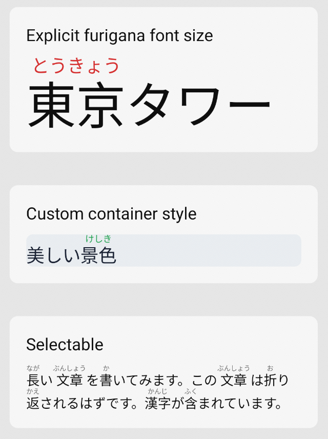

Native Japanese furigana rendering for React Native apps. Uses CoreText ruby annotations on iOS and custom `ReplacementSpan` rendering on Android.

## Installation

```sh
npm install react-native-furigana-text
```

Requires Expo SDK 57+ and React Native 0.86+. This is an Expo Module — it works in both Expo managed and bare React Native workflows.

## Usage

Kanji followed by `[reading]` gets furigana above it:

```tsx
<FuriganaText text="漢字[かんじ]を読[よ]みます。" />
```

Custom colors for text and furigana:

```tsx
<FuriganaText text="東京[とうきょう]タワー" color="#1f2937" furiganaColor="#dc2626" />
```

Explicit furigana font size (defaults to half the main font size when not set):

```tsx
<FuriganaText text="美[うつく]しい景色[けしき]" fontSize={22} furiganaFontSize={14} />
```

Container styling:

```tsx
<FuriganaText
  text="寿司[すし]"
  style={{ padding: 10, backgroundColor: '#f1f5f9', borderRadius: 8 }}
/>
```

### Props

| Prop | Type | Default | Description |
|------|------|---------|-------------|
| `text` | `string` | **required** | Text containing kanji with furigana in format `漢字[かんじ]` |
| `fontSize` | `number` | `16` | Font size for the main text |
| `color` | `string` | `'#000000'` | Text color (hex string) |
| `furiganaFontSize` | `number` | `fontSize * 0.5` | Font size for furigana text |
| `furiganaColor` | `string` | `'#666666'` | Furigana text color (hex string) |
| `style` | `ViewStyle` | - | Style for the container |
| `selectable` | `boolean` | `false` | Enable text selection |

## Platform notes

- **iOS** — Uses `CTRubyAnnotation` via CoreText's `CTFramesetter`/`CTFrameDraw`. The view self-sizes via Fabric's `setViewSize`. Line height is normalized with `minimumLineHeight` so lines without furigana match the height of lines with furigana.
- **Android** — Uses a custom `ReplacementSpan` that draws furigana centered above each kanji group. The view self-sizes via `onMeasure`. A `LineHeightSpan` normalizes line height across lines with and without furigana. A synchronous `measureHeight` function is exposed to JS for two-pass layout (see below).
- **Web** — Falls back to a React Native `Text`-based implementation with inline furigana using nested `Text` components.

## Development

### Building from source

```sh
npm run prepare
```

This runs TypeScript compilation and outputs to `build/`.

### Running the example app

The example app is in `example/`. After making any changes (native or TypeScript), you **must re-publish via yalc** before rebuilding:

```sh
npm run prepare && yalc push
cd example
npx expo run:ios     # or: npx expo run:android
```

> **Important:** Both iOS and Android builds compile native code from `example/node_modules/react-native-furigana-text/` (the yalc copy), not from the root `ios/` or `android/` folders. Always run `yalc push` after modifying native files, or your changes won't reach the build.

### iOS setup

If `pod install` fails with a Ruby `Encoding::CompatibilityError`, run with UTF-8 locale:

```sh
LANG=en_US.UTF-8 LC_ALL=en_US.UTF-8 pod install --project-directory=example/ios
```

The example's `Podfile` uses `use_expo_modules!(searchPaths: ['../..'])` so the autolinker can discover the module at the project root.

### Android two-pass layout

Android's `ExpoView` (extends `LinearLayout`) doesn't support intrinsic content size the way iOS Fabric does. To handle this, the module exposes a synchronous `measureHeight` function that JS calls after the first `onLayout` to compute the content height:

1. First render — Yoga stretches the view (`alignSelf: 'stretch'`), `onLayout` fires with the actual width
2. `NativeModule.measureHeight(text, furigana, width, fontSize, furiganaFontSize)` returns the content height in dp
3. Second render — height is set on the view, Yoga lays out the final size

## License

MIT